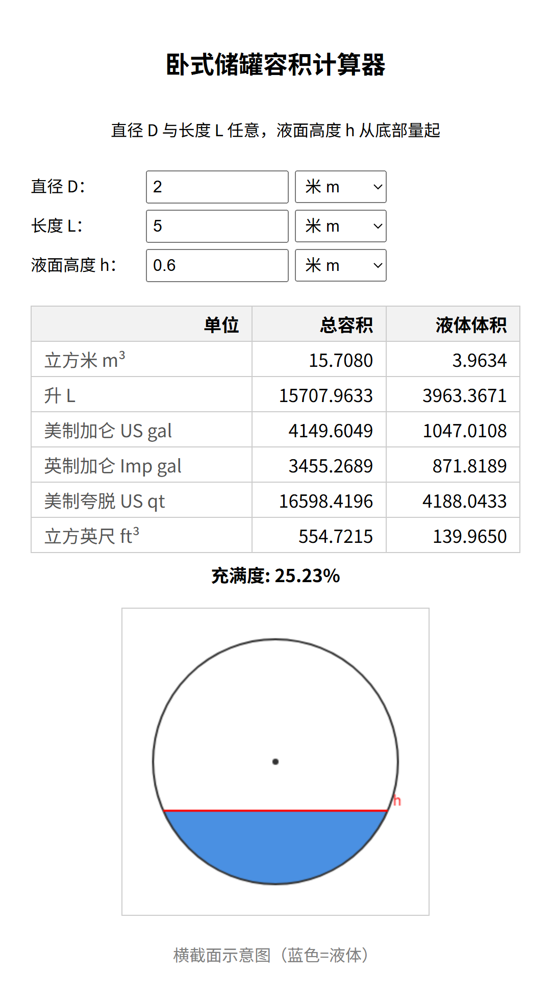
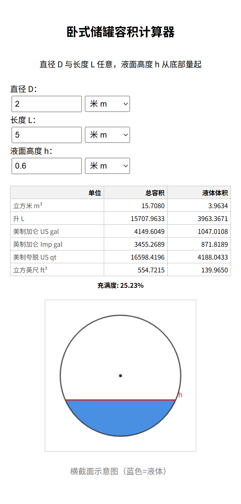

# 卧式储罐容积计算器

一个单文件、纯静态的卧式（平躺）圆柱储罐**容积/液体体积计算器**，参考 [CalculatorSoup Tank Volume](https://www.calculatorsoup.com/calculators/construction/tank.php) 实现。无需安装、无需服务器，打开即用，可离线、适配手机。

## 在线访问

部署在 GitHub Pages：**https://mic-ha-cp.github.io/tank-volume/**

## 截图

<table>
  <tr>
    <th>电脑端</th>
    <th>手机端</th>
  </tr>
  <tr>
    <td></td>
    <td></td>
  </tr>
</table>

## 功能

- **三个输入**：直径 D、长度 L、液面高度 h（从底部量起）。
- **每个变量可独立选择长度单位**：厘米 cm / 米 m / 英寸 in / 英尺 ft。
- **多单位输出**：总容积与液体体积同时换算为 6 种单位——立方米 m³、升 L、美制加仑、英制加仑、美制夸脱、立方英尺，并显示充满度百分比。
- **横截面可视化**：实时绘制液面位置（蓝色为液体）。
- **响应式**：桌面与手机浏览器均可正常使用。

## 计算原理

液体横截面为圆的**弓形**，面积

```
A = R²·arccos((R-h)/R) − (R-h)·√(2Rh − h²)
```

液体体积 = A × L，总容积 = π·R²·L（R = D/2，h 限制在 0~D）。所有输入先统一换算为米再计算。

## 本地使用

直接用浏览器打开 `index.html` 即可；或传到手机用浏览器打开。

## 技术

原生 HTML / CSS / JavaScript，单文件 `index.html`，无依赖、无构建步骤。
